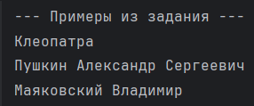
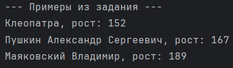
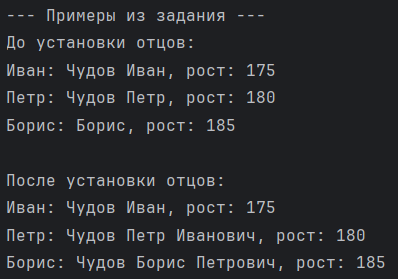
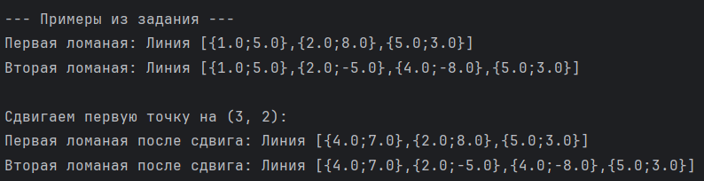
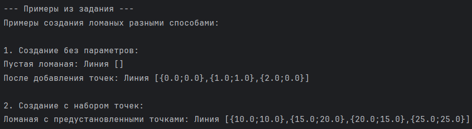
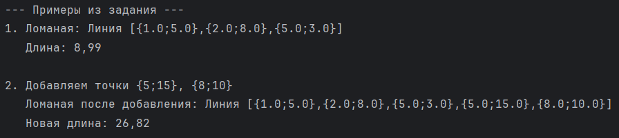

# Тетерина Юлия 7 группа 
# Лабораторная №2

# Задание 1
### Задача 3
Имена.  
Создайте сущность Имя, которая описывается тремя параметрами: Фамилия, Личное имя,
Отчество. Имя может быть приведено к строковому виду, включающему традиционное
представление всех трех параметров: Фамилия Имя Отчество (например “Иванов Иван
Иванович”). Необходимо предусмотреть возможность того, что какой-либо из параметров может
быть не задан, и в этом случае он не учитывается при приведении к текстовому виду.
Необходимо создать следующие имена:
* Клеопатра
* Пушкин Александр Сергеевич
* Маяковский Владимир  
Обратите внимание, что при выводе на экран, не заданные параметры никак не участвуют в
образовании строки.
### Алгоритм решения задачи
1. Создать класс Name с тремя полями: фамилия, имя, отчество
2. Реализовать три конструктора:
* Только имя
* Фамилия и имя
* Полное ФИО
3. В методе toString():
* Проверить каждое поле на null/пустоту
* Добавлять только заданные поля в результат
* Разделять пробелами
### Пример решения задачи

# Задание 2
### Задача 2
Человек с именем.  
Объедините сущности Человек из задачи 1.2 и Имя из задачи 1.3 таким образом, чтобы имя
человека задавалось с использованием сущности 1.3, а не строки.  
Необходимо объединить ранее созданные объекты имен и людей, с получением:
* Человека с Именем Клеопатра и ростом 152 
* Человека с Именем Пушкин Александр Сергеевичи ростом 167 
* Человека с Именем Маяковский Владимир и ростом 189
### Алгоритм решения задачи
1. В классе Person заменить поле String name на Name name
2. Конструктор принимает объект Name вместо строки
3. В toString() вызывать name.toString() для получения строкового представления
### Пример решения задачи

# Задание 2
### Задача 3
Человек с родителем.  
Измените сущность Человек из задачи 2.2 добавив ему возможность задавать третий параметр:
Отец, где Отец — это тоже Человек. При приведении человека к строковой форме необходимо
проверить параметры имени, и в зависимости от ситуации выполнить одно из следующих
действий:
* Если у данного человека нет фамилии, и есть отец, у которого фамилия задана, то
фамилию необходимо сделать такой же как у отца.
* Если у данного человека нет отчества, а у отца есть имя, то необходимо задать отчество
как имя отца с добавлением суффикса “ович”.  
Затем необходимо выполнить следующие задачи:
1. Создать людей: Чудова Ивана, Чудова Петра, Бориса
2. Сделать Ивана отцом Петра, а Петра отцом Бориса
3. Вывести на экран строковое представление всех троих людей.
### Алгоритм решения задачи
1. Добавить в класс Person поле Person father
2. При установке отца (setFather()) выполнить наследование:
* Если у человека нет фамилии → взять фамилию от отца
* Если у человека нет отчества → создать отчество от имени отца + "ович"
3. Создать трех людей и установить родственные связи
### Пример решения задачи

# Задание 3
### Задача 2
Ломаная.
Создайте сущность Ломаная, которая будет представлять собой ломаную линию. Ломаная линия представляет собой набор следующих характеристик:
* Имеет массив Точек (из задачи 1.1), через которые линия проходит. 
* Может быть приведена к строковой форме вида “Линия [Т1,T2,…,TN]”, где TN – это
результат приведения к строке Точки с номером N
Необходимо выполнить следующие задачи:
1) Создать первую Ломаную, проходящую через точки {1;5}, {2;8}, {5;3}
2) Создайте вторую Ломаную, чья первая и последняя Точка совпадает с таковыми у первой
Ломаной, но в качестве середины имеет точки: {2,-5}, {4,-8}
3) Сдвиньте начало первой Ломаной таким образом, чтобы одновременно сдвинулось
начало второй Ломаной.
### Алгоритм решения задачи
1. Создать класс Point с координатами X, Y и методом toString()
2. Создать класс Polyline с коллекцией точек
3. Реализовать:
* Добавление точек
* Получение первой/последней точки
* Сдвиг всех точек
4. Создать две ломаные с общими начальной и конечной точками
5. Показать, что сдвиг общей точки влияет на обе ломаные
### Пример решения задачи

# Задание 4
### Задача 9
Создаем Ломаную.
Измените сущность Ломаная из задачи 1.3.2. Новые требования включают:
* Ломаная может быть создана без указания каких-либо параметров
* Ломаная может быть создана с указанием некоторого набора Точек
### Алгоритм решения задачи
1. Реализовать в Polyline:
* Конструктор без параметров (пустая ломаная)
* Конструктор с набором точек
* Методы добавления точек по одному и группами
2. Показать разные способы создания ломаной
### Пример решения задачи

# Задание 5
### Задача 7
Длина Ломаной.  
Измените сущность Ломаная из задачи 4.9. Новые требования включают:
* В любой момент к имеющимся Точкам можно добавить новые Точки (добавляется либо
массив, либо просто перечень Точек, что приводит к получению нового массива,
содержащего как старые, так и новые значения).
* Может возвращать общую длину Ломаной.
Необходимо выполнить следующие задачи:
1. Создать Ломаную, проходящую через точки {1;5}, {2;8}, {5;3}
2. Вывести на экран её длину
3. Добавить (к ранее созданной Ломаной) точки {5;15}, {8;10}
4. Снова вывести на экран длину Ломаной
### Алгоритм решения задачи
1. Создать класс PolylineWithLength наследованием от Polyline
2. Реализовать метод getLength():
* Пройти по всем точкам от первой до последней
* Для каждой пары соседних точек вычислить расстояние по формуле:  
√((x₂-x₁)² + (y₂-y₁)²)
* Суммировать все расстояния 
3. Реализовать методы добавления массивов/списков точек
### Пример решения задачи
